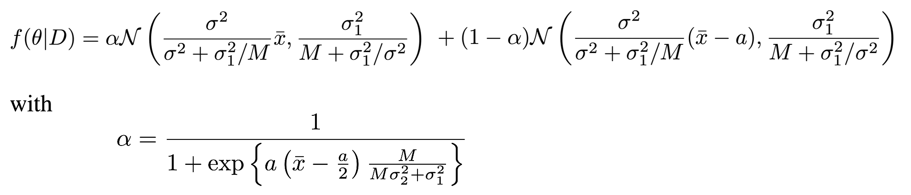

# Approximate Bayesian Computation

This was the final project for the [stochastic simulation](https://edu.epfl.ch/coursebook/en/stochastic-simulation-MATH-414) course I took during my exchange semester at EPFL in the Winter semester of 2023/2024, in collaboration with Hadi Hammoud. In this project, we implemented and compared two Approximate Bayesian Computation (ABC) methods on two problems, one of which involved modeling the concentration of theophylline in the blood. Additionally, we developed two approaches for efficient Monte Carlo estimation of the expected theophylline concentration under a given stochastic model.

## Methods

### ABC-Rejection

Let us start with the most simple ABC rejection algorithm. The algorithm begins by sampling potential parameters, denoted as θ∗, from the prior distribution π(θ). A data sample, D∗, is then generated based on these candidate parameters θ∗. The algorithm evaluates the similarity between the generated data and the observed data, D, using a predefined discrepancy metric, ρ(·, ·), and a tolerance value, ε. In the acceptance or rejection step, candidate parameters are considered samples from the posterior distribution if the simulated data closely matches the observed data according to the chosen discrepancy metric, ρ(·, ·), and the tolerance, ε. If there is no match, a new candidate is drawn from the prior distribution. This process is repeated until a sufficiently large sample size, N, approximately following the posterior distribution, is obtained.


### ABC-MCMC

The sampling strategy outlined in Algorithm 1 may not be the most efficient choice in the context of ABC, as acceptance rates can be very low. When dealing with complex models or high-dimensional parameter spaces, the basic rejection algorithm may result in a significant number of proposed samples from π(θ) being rejected during the acceptance/rejection step. A low acceptance rate indicates that a large portion of the computational effort is spent generating samples that do not contribute to the final posterior approximation.

In such scenarios, more sophisticated approaches have been developed, such as integrating the ABC scheme with the Metropolis-Hastings framework, as shown in Algorithm 2. In this method, the candidate parameter vector is created using an arbitrary proposal transition density, q(·, ·), and is accepted based on a Metropolis-Hastings type acceptance probability. In this probability calculation, the (intractable) likelihood ratio, P(· | θ∗)/P(· | θi), is approximated by 1 if the simulated and observed data are sufficiently close according to the chosen metric, ρ(·, ·), and by 0 otherwise.


The implementation of both methods can be found in the file `approx_bayesian_computation.py`.

## Examples

### Academic Example

We begin with an example involving known likelihood and posterior distribution functions, which allows for a direct comparison. In this example, the observed data, denoted as D = {xi} for i = 1 to M, is an independent and identically distributed (i.i.d.) sample drawn with probability 1/2 from a normal distribution, N(θ, σ1²), and with probability 1/2 from another normal distribution, N(θ + a, σ1²). The prior distribution is assumed to be a normal distribution, π = N(0, σ²). As a result, the posterior distribution is a Gaussian mixture given by:



We consider the following parameters: the sample size M = 100, variance σ1² = 0.1, prior variance σ² = 3, and shift parameter a = 1. We assume that the sample mean of the data is exactly x̄ = 0. The figure below shows the true posterior plottet against different estimates obtained by the simple ABC rejection algorithm with different tolerances.


The code for running experiments on this theoretical example using both methods is stored in `academic_example.py`.

### A model in Pharmacokinetics

In practical applications, the posterior distribution is usually not known. We consider a dynamic model of the pharmacokinetics of Theophylline, a drug used in the treatment of asthma and chronic obstructive pulmonary disease. This model represents the concentration of Theophylline in the bloodstream, denoted as X_t, at any given time t, using a stochastic differential equation


In this equation, D represents the known oral dose of the drug, K_e is the elimination rate constant, K_a is the absorption rate constant, Cl denotes the drug clearance, and σ is the intensity of intrinsic stochastic noise driven by Brownian motion W(t).

For the experimental design, we consider a single subject with nine blood samples taken at the following times after dosing: 0.25, 0.5, 1, 2, 3.5, 5, 7, 9, and 12 hours. The oral dose is set at 4 mg, administered at the initial time t = 0, and the initial concentration of the drug in the blood is set to 0.

To approximate the stochastic differential equation, we use the Euler-Maruyama method on a fine time grid. Following the methodology from Donnet and Samson (2008), we discretize each interval between consecutive times [t_i, t_(i+1)] into 20 equal steps. This approach is expected to closely approximate the true model.


We use the parameters theta = (K_e, K_a, Cl, σ) = (0.08, 1.5, 0.04, 0.2) to generate synthetic measurement data, denoted as D, consisting of nine observations. The data is generated using the Euler-Maruyama discretization method. The accompanying figure shows 1,000 samples generated with these parameters, highlighting in blue the sample D used in subsequent analysis. The concentration of Theophylline initially increases during the first four hours after intake and then gradually decreases.

The plot below shows 1,000 samples generated from the pharmacokinetic model using the parameters (K_e, K_a, Cl, σ) = (0.08, 1.5, 0.04, 0.2). The blue line represents the sample D, which serves as the basis for estimating the posterior distribution.


The code for running experiments on this theoretical example using both methods is stored in `pharmacokinetic_model.py`.

# Code

## Introduction
This project is focused on the implementation of two algorithms for likelihood-free approximation of the posterior distribution: the ABC-Rejection and the ABC-MCMC (Approximate Bayesian Computation - Markov Chain Monte Carlo) methods. These algorithms are particularly useful in scenarios where the likelihood is difficult to compute or unknown.

## Project Overview
- **Academic Example**: We have included an academic example with a known true posterior to analyze the performance of both the ABC-Rejection and ABC-MCMC methods.
- **Stochastic Differential Equation Model**: The project also explores a stochastic differential equation that models the level of Theophylline in the blood over time.

## Repository Structure
- `distribution`: This file contains all the distributions used within the examples. The `rvs` method is used for sampling from a distribution, and the `pdf` method for evaluating the density at certain points.
- `approx_bayesian_computation.py`: Defines the ABC-Rejection and ABC-MCMC algorithms.
- `discrepancy_metric.py`: Implements the discrepancy metric, which plays a crucial role in these algorithms.

## Getting Started

### Setting Up
1. **Create a Virtual Environment (Recommended)**
   ```bash
   python -m venv venv
   ```
2. **Activate the Virtual Environment**
    On Windows
    ```bash
   venv\Scripts\activate
   ```
   On Unix or MacOS:
   ```bash
   source venv/bin/activate
   ```
3. **Install Required Packages**
   ```bash
   python -m venv venv
   ```

### Running the Experiments
- **Academic Example with ABC-Rejection**
     ```bash
   python academic_example.py --method=abc_rejection --M=100 --N=500 --plot_distance=True
   ```
- **Academic Example with ABC-MCMC**
     ```bash
   python academic_example.py --method=abc_mcmc --nu=nu --M=100 --N=500
   ```
   Note: Replace `nu` with the desired standard deviation of the proposal distribution.
- **Pharmacokinetic Model**
    ```bash
   python pharmacokinetic_model.py
   ```
